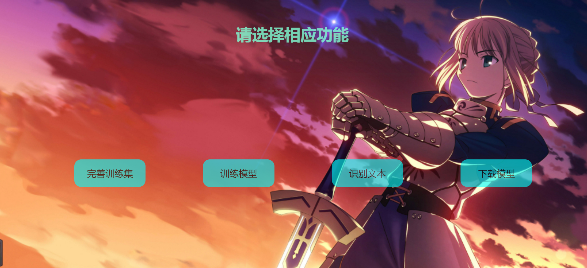
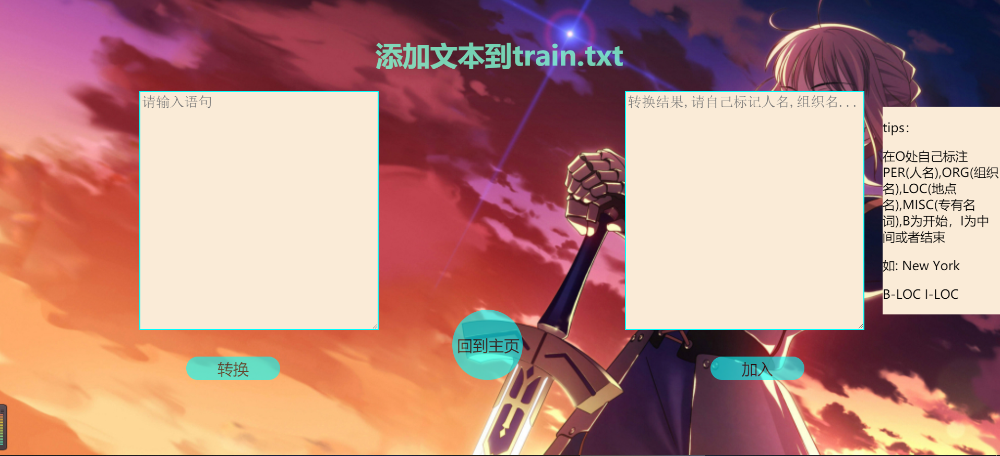
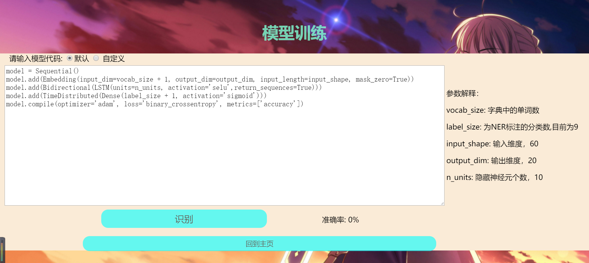
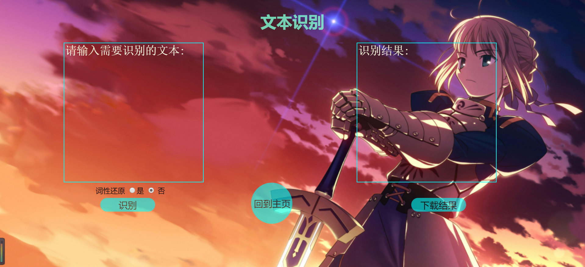
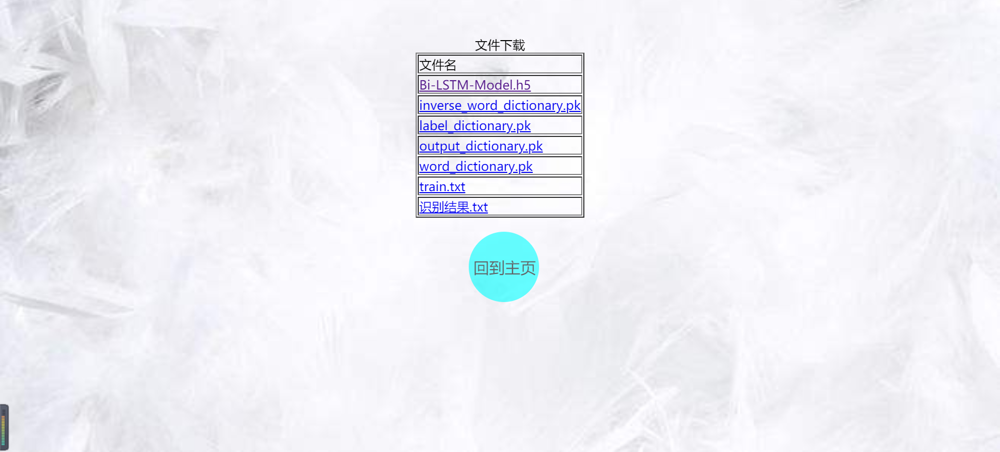

# 命名实体识别项目

## 环境要求
flask 1.0.2

TensorFlow 1.15.0

keras 2.3.1

注意：keras与TensorFlow版本不匹配可能运行会报错。

## 效果
|             主页面             |           添加训练集页面           |
| :------------------------------: | :------------------------------: |
|  |  |

|             训练模型页面             |           识别页面           |
| :------------------------------: | :------------------------------: |
|  |  |

|             下载页面           |  
| :------------------------------: | 
|  | 

演示视频：<https://www.bilibili.com/video/BV13A411B7p3/>

## 运行方法
```
python services.py
点击index.html进行访问
```